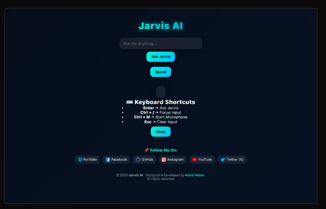

# Jarvis AI 🤖  

**Jarvis AI** is a web-based virtual assistant that supports both **text** and **voice** input.  
It comes with a **futuristic glassmorphic UI**, **typing animation**, **mic pulsing effect**, and **keyboard shortcuts** for smooth interaction.  

---

## 🔹 Features
- 💬 **Text Input:** Ask questions directly by typing.  
- 🎙️ **Voice Input:** Use the microphone to speak your queries.  
- ⌨️ **Keyboard Shortcuts:**  
  - `Enter` → Ask Jarvis  
  - `Ctrl + /` → Focus input field  
  - `Ctrl + M` → Start microphone  
  - `Esc` → Clear input  
- ⏱️ **Current Time:** Displays local Dhaka time.  
- 🌐 **Open Links:** Directly search/open YouTube, Google, and Facebook.  
- ✨ **Typing Animation & Mic Pulse:** Enhances the UI experience.  
- 🔗 **Social Links Footer:** Portfolio, GitHub, Facebook, Instagram, YouTube/X.  

---

## 🔹 Screenshot
  

---
```
📂 Project-Folder/
│
├── 📂 Assets/
│   ├── 📂 Screenshots/
│   │   ├── screenshot1.png
│   │   └── screenshot2.png
│   └── favicon.png   (বা favicon.ico)
│
├── index.html
├── style.css
├── script.js
└── README.md
```
## 🔹 How to Use
1. Clone the repository:
   ```bash
   git clone https://github.com/HasibCoderLab/Jarvis-AI.git
   ```
Open index.html in your browser.

Type or speak your command.

Explore keyboard shortcuts and enjoy the futuristic UI.

🔹 Technologies Used

HTML5

CSS3 (Glassmorphic + Gradient Design)

JavaScript (ES6, Speech Recognition API)

© 2025 Jarvis AI · Designed & Developed by Hasib Hasan
All rights reserved.